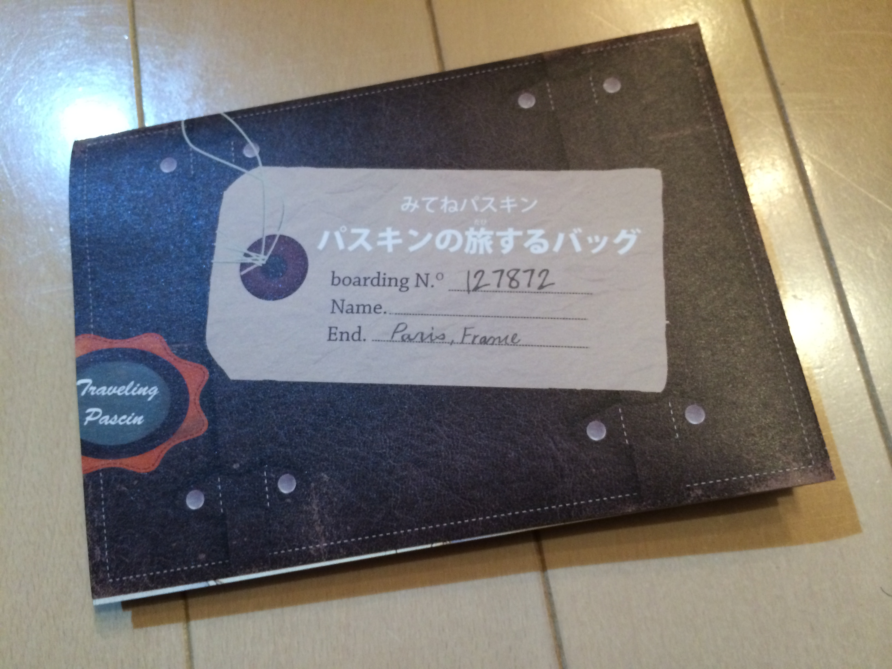
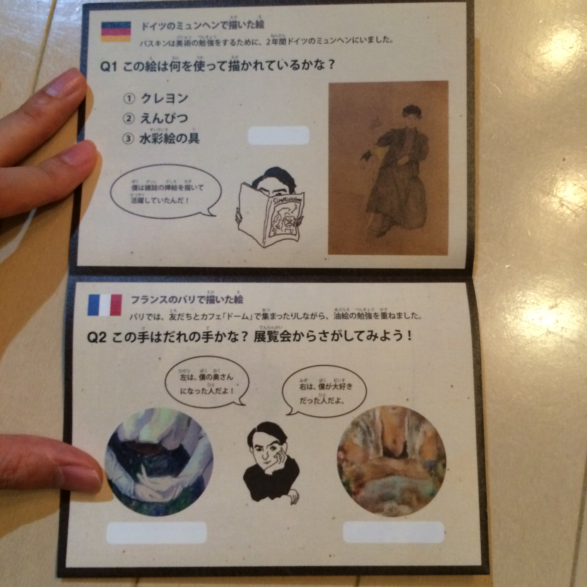
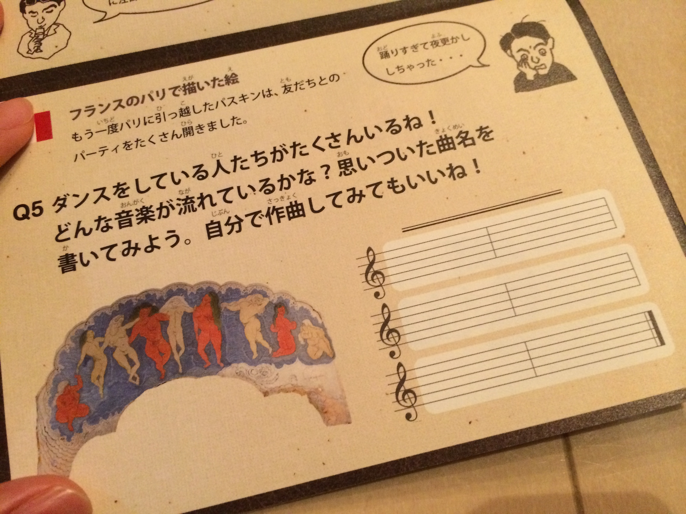

この美術館は、展示のやり方が私好みで気に入っている。

以前４Kディスプレイによる美術紹介をしていて、「ここでこそ高解像度を使うべきだよな」と感心したものだった。

今回感心したのはこれ。

入口で主にお子様向けに用意されている印刷物なのだが、これがなかなか良く出来ていたのでご紹介したい。

中身は簡単なクイズになっている。

1問目は「この絵は何を使って描かれているかな？」

これが1問目に来ているのはなかなか巧妙だ。

小中学生くらいの標準的な知識だと、「本格的な絵は筆で描くもの」という先入観があるだろう。

そこで、こんなクイズを出されるので絵をよく見ると、なんと鉛筆描きである。

パスキンは、ふわふわとした柔らかい表現の画家として有名だが、当初は鉛筆による素描を書きまくった画家だったことを鮮明に記憶させる。

実に巧妙なフックだ。

2問目が凄い。

2枚の絵の一部が示される。どちらも女性っぽい。

それぞれ誰をモデルにしているかを問うクイズなのだが、ヒントが

「左は、僕の奥さんになった人だよ！」

「右は、僕が大好きだった人だよ。」

となっている。

「結婚相手と、大好きな人とは別なのか」という軽い衝撃が走る。

あるいは、少し推理力のある鑑賞者なら「大好きだった人」というのは母親ではないか？と考えるかもしれない。

気になる。

気になりながら絵を探すことになる。1枚目(左側)はすぐに見つかり、注釈を見ると答えがわかる。

2枚目は、見つからない。

同じ部屋にはなく、実は最後の部屋にあるのだ。

鑑賞者は「結婚相手ではない大好きな人」の正体を気にしながら、注意深く最後の部屋まで絵を探し続けることになる。

巧妙と言わざるを得ない。

次の問題は、「絵の中に何人の人物がいるか？」を問うクイズ。

問題の隣に、対象となる絵が小さく印刷されている。

場面はカフェで、3人の人物が丸テーブルを囲んでいるのが見える。

絵の実物を見ずに答えようとすると、３と書いてしまうところだ。しかしこれが罠。

原画を見ると、主役3人の肩越しに背景に溶け込んだ人物達が見えてくる。しかもこれがかなりうっすらぼんやりしていて「これは人物かな？ 違うのかな？」と思わせる箇所がいくつかある。1枚の絵をじっくり細部まで観察し、なお解釈の余地があり、回答に迷う。

ちなみにすべてのクイズは裏面に答えが載っており、この問題の答えは「８〜10人」となっている。このあやふやさをあえて示すこともまた、絵画鑑賞について考えるきっかけになりそうだ。

次の問題がまた凄い。

正解はない。思いついた曲名を書け、というのだ。

そして、さも当然にように示される白紙の五線譜と、「自分で作曲してみてもいいね！」という誘い。

殆どの鑑賞者は、自分で作曲などしたことは無いだろう。あるいは知ってる曲であっても、五線譜にいきなり音符を書けるのは、特別な教育をうけた人々だけだ。

出題者はとんでもない無茶ぶりをしている。

だが、この無茶ぶりには深い意味があると私は思う。

さも当然のようにこの問いを向けられた鑑賞者は、何を思うだろうか。

どうせ正解など無いのだから、でたらめに楽譜を書いてみてもいい。

「あれ、楽譜って読み方は習ったけど、書けないぞ」と気づくことにも意味がある。

あるいはすらすらと書いてみせる生徒がいても面白い。

私の記憶では小中9年間の義務教育に「作曲」の課程は無い。課程が無い＝評価される機会も無いということだ。

その意味で、隠された才能にスポットを当てる設問でもある。

ところで、この絵の近くに、「大好きだった人」の絵がようやく見つかる。

そこには衝撃的な解説がある。二人の女性の名前をメモしてから、展示場の最後にある年表と白黒写真を見ると、またいろいろと発見があって盛り上がる。

「パスキン」の名前を忘れられなくなること受け合いだ。

クイズは全7問で、ここに紹介したもの以外もそれぞれ別々の役割が込められている。

芸術鑑賞とはどうあるべきか、それをどう実践させるか。実によく考えられたパンフレットだと思う。

会期は始まったばかりで、3/29まで。
