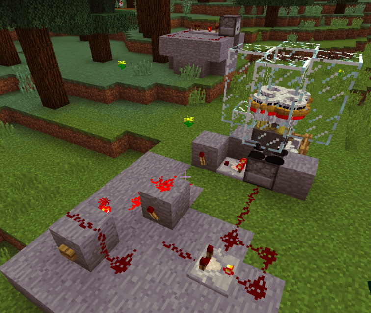

先月くらいから、遅ればせながら minecraft を始めた。大変面白い。
最初は攻略情報を可能な限り避けて自力で解いていくのが私のゲームの楽しみ方なのだが、 minecraft はある程度情報を調べながら進めるのが前提となっている。例えば、鎧や盾のような基本的なアイテムの入手方法が最初は全くわからない。公式wiki 等でレシピを見ずにこれを入手するのは非現実的な試行錯誤が必要となる。
ところが、いざ調べるとなると情報が詳細までまとまりすぎているのが私には問題で、一番弱い鎧の作り方だけ知れれば十分だったのに、すぐ隣に最強の鎧の作り方が載っているのでそれが目に入ってしまう。これはゲームの楽しみを奪われた、と私は感じる。なので出来るだけ調べたくないのだ。
もうちょっと、ヒントを小出しにしてくれるサイトがあったら嬉しい。

幸い minecraft には、膨大な情報量の公式 wiki を全部頭に入れてもなお存分に楽しむ余地はあるのだが。
その1つが各種自動装置の設計だ。

minecraft には、敵と戦いながら装備を整えてラスボス討伐を目指す "survival mode" と、敵に襲われることなく資源を無限に使って自由に建築を楽しむ "creative mode" の2つがある。
youtube 等で検索すると、あらゆる大規模な自動装置が紹介されているが、そのほとんどは creative mode で作られており、 survival mode で同じものを作るのは高コストすぎる。
私はまだ survival mode をクリアしていない (Nether potal に入るとすぐ死にそうになるので diamond を探している段階) ということもあり、低コストで実用的な装置を求めている。

survival mode では食料確保が当面の大きな課題となるので、いかに効率良く食糧確保するかを考える。
数種類の家畜のうち、ニワトリが最も管理しやすいと思った私は早速、柵を2囲い作り、一方で卵を集め、もう一方で卵から雛を孵して食料源にする、という運用を始めた。
次第に、大量の卵を手で投げるのが面倒になったので、卵連射装置を作った。
集めた卵を dispenser に詰めてスイッチを入れると、卵を勝手に投げ始める。全部投げるのに1分ほどかかるがその間は放置して、装備のメンテナンス等、別の作業が出来る。
dispenser が空っぽになるとカチカチうるさいので、スイッチを切る。

これでしばらく運用していたのだが、そろそろ卵集めの自動化をするか、ということで creative mode で色々実験し、これは意外と簡単に実現できることがわかった。
ついでに、 dispenser が空になった時に自動的にスイッチが切れる仕組みを入れたいと思い、 redstone 回路について少々勉強し、 RS Latch 回路を組めば実現可能であることがわかった。

出来上がったのが添付のスクリーンショット。
これは creative mode で作ったものだが、これくらいの規模なら survival mode で作る気になる。

右上の、ガラスブロックに囲まれた少々気持ちの悪いモノはニワトリの集合体で、小さなスペースに50匹くらい押し込めておく。ニワトリは一定時間ごとに卵を産み、これが dispenser に自動的に溜まる。

左下が、 RS Latch 回路と連射装置。ボタンを押すと連射が始まり、空になると止まる。
「空になったら自動でスイッチを止める」という仕組みのためだけに RS Latch を組み込むのは大げさな気がしたが、 redstone は余っているのでコスト的には大したことはない。
立体回路を組むともう少しコンパクトになると思うが、まだそこまでの技術がない。いずれ挑戦したい。

実はここにたどり着く前に、「dispenser に卵が入ると自動的に投げる」という回路も作ったのだが、運用上問題があったのでボツにした。
添付画像の左上に残骸が写っている。この角度だとよく見えないが。

次はニワトリ→鶏肉の自動化か。でもここ自動化すると経験値をもらい損ねるので勿体無い気もする。

